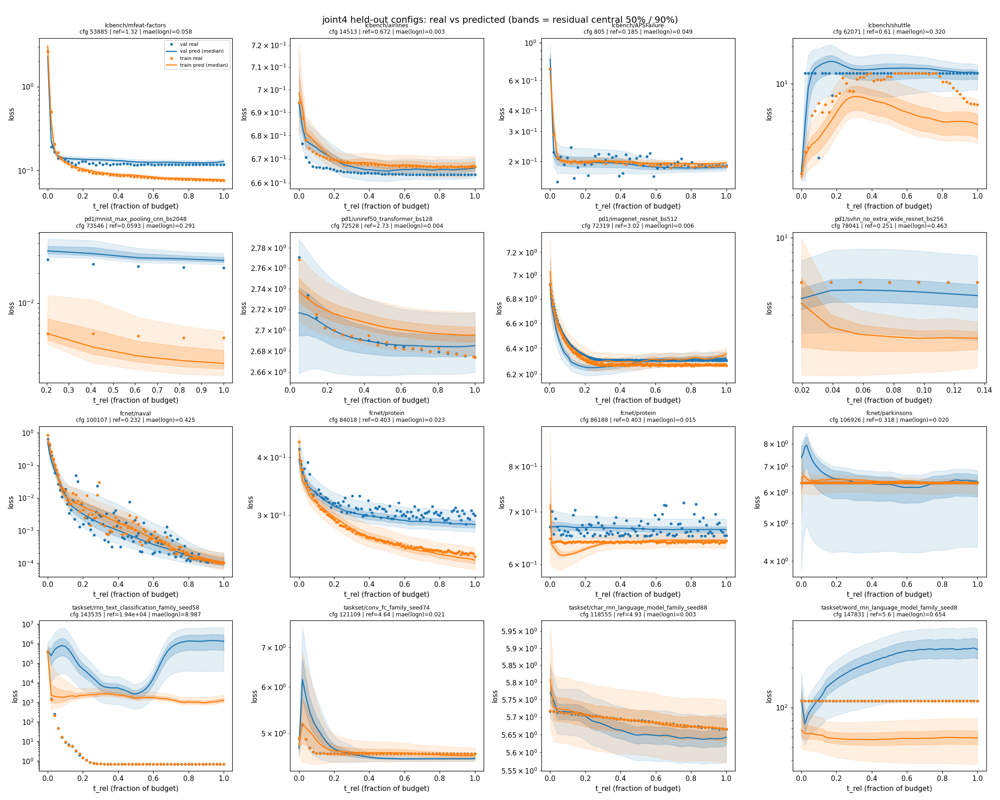

# learning-faker

A **stochastic training simulator** for hyperparameter optimization: a model that
predicts learning curves `f(config, task, t) → (val_loss, train_loss)` from HPO
benchmark data. The goal is a better HPO surrogate than tabular lookup — one that
generalizes across the config space and emits *distributions* of curves rather than
snapping to a fixed table of observed runs.

## Held-out predictions

Real vs. predicted curves for configs the model never saw during training, across all
four datasets. Line = predicted **median**, bands = central 50% / 90% quantiles, dots =
real (blue = val, orange = train). Losses are shown in absolute units (recovered per
task); `mae(logn)` is the median error in normalized log-space.



The model captures the fast initial descent, the aleatoric seed-scatter (e.g.
`fcnet/naval`, whose repeated-seed cloud sits inside the bands), and flags divergence
with wide upper tails.

## Approach

- **Encoder — DeepSets sum-pooling.** A config is a variable-length *set* of parameter
  tokens; each token is `type_emb[p] + value·num_dir[p]` (numeric) or `cat_emb[cat]`
  (categorical), summed with a learned per-task embedding. Permutation-invariant,
  handles differently-dimensioned configs, no attention needed (~150k params).
- **Time** enters only as `t_rel` (fraction of the task's budget) via Fourier features
  into the head; absolute compute scale is absorbed by the task embedding.
- **Head — median-centric quantile regression.** A gated MLP (GLU) per channel predicts
  monotone **absolute quantiles** of the target (softplus-increment + cumsum, no
  crossing). The point estimate is the median (`τ=0.5`), so it can never fall outside
  its own band. Trained with **pinball loss only** — no MSE, no NLL; a proper,
  Wasserstein-flavored objective robust to the divergence tail.
- **Targets — per-task normalized.** `y = log(loss / ref_task)`, where `ref_task` is the
  25th percentile of the val loss shortly into training (a "sensible config's baseline").
  This puts wildly different task scales (VAE at ~1e4 nats vs. a classifier at ~0.5 CE)
  into a common ballpark. Divergence is capped at 20× baseline.

## Datasets

Merged into one shared vocabulary (`learning_rate`, `batch_size`, etc. share type ids
across datasets for real cross-dataset transfer):

| source | tasks | notes |
|---|---|---|
| LCBench | 35 | per-epoch, SGD + cosine |
| PD1 | 19 | transformers/ResNets/CNNs, per-eval-step |
| FCNet | 4 | 4 seed replicas → genuine aleatoric signal |
| TaskSet | ~245 | diverse RNN/CNN/MLP/flow/VAE tasks; HPs recovered pure-numpy from seeds |

Synthetic optimization toys (`quadratic_family`, `losg_tasks_family`, `TwoD_Bowl`) are
excluded — they converge to machine precision and aren't real learning curves.

## Usage

```bash
python -m lcfaker.train --source joint4 --epochs 20   # build + train (writes checkpoint_joint4.pt)
python scripts/plot_val_curves.py                     # held-out real-vs-predicted curves
python scripts/audit_families.py                      # per-family convergence-depth audit
```

A trained checkpoint (`checkpoint_joint4.pt`, 303 tasks) is included.
